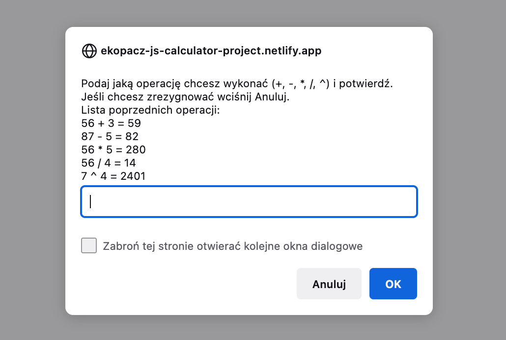
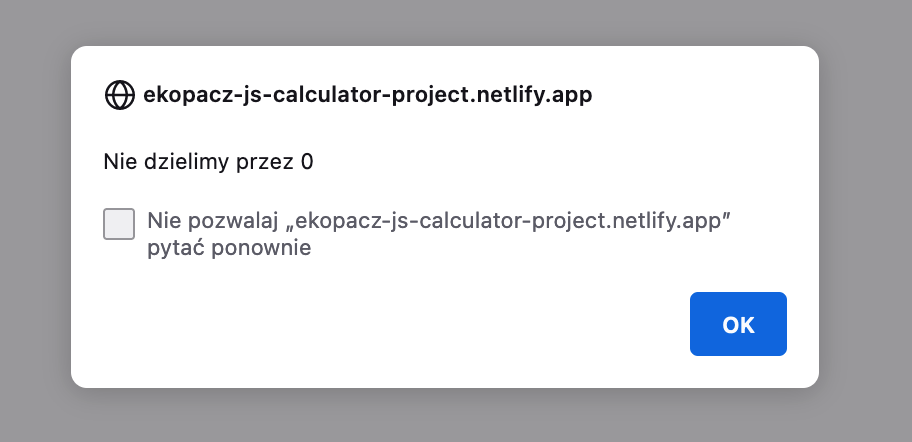

# JS Basics - Calculator Project

## About the project:
My first project in JavaScript. Using existing code, I had to add a functionality like basics math operations:
* (+)
* (-)
* (*)
* (/)
* (^)

## How to use it
Please visit the website below and follow the instruction to see how calculator works.

## Technologies:
* JavaScript

## Links
* Live Site URL: [E.Kopacz JS Basics Calculator Project](https://ekopacz-js-calculator-project.netlify.app)

## Solutions
Creating this project I had an opportunity to practice: 
* creating and using function in JS,
* creating and using loops in JS,
* creating and using if…else Statements in JS 
* creating and using JavaScript Object Prototypes
* how to use 'this' keyword in JS
* what is  'code refactoring' and why it is important

### Project preview

Examples of calculations with history

Dividing by zero

### Feel free to contact me:
* [Linkedin](https://www.linkedin.com/in/ewelina-kopacz-929559100/) - Ewelina Kopacz

### Thanks for project and support to Mateusz Bogolubow:
* Mentor i Trener Programowania JavaScript - [DevMentor](https://devmentor.pl/) - Mateusz Bogolubow
